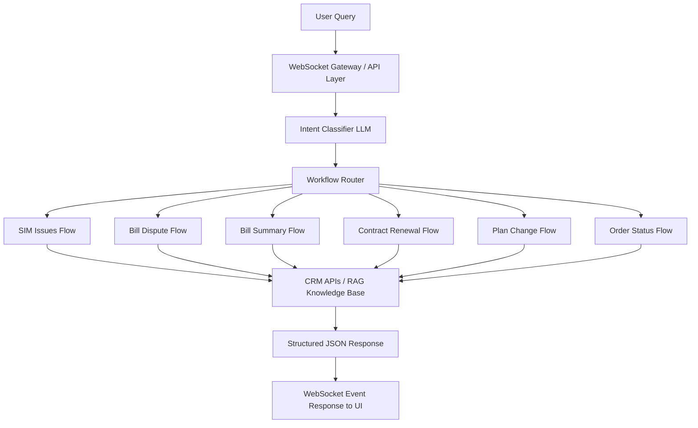
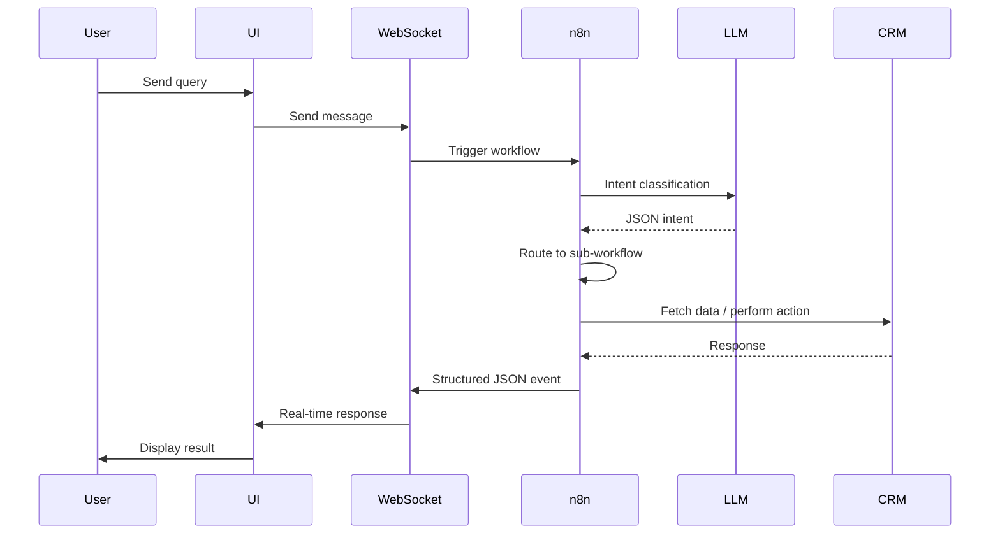

# 📡 AI-Powered Telecom CRM Automation Platform
### n8n + LLM + Redis Memory + WebSocket Event Streaming

An intelligent **Telecom CRM Automation System** built using **n8n workflows, LLM agents, Redis memory, WebSocket event streaming, and strict JSON extraction logic**.

The system automatically **classifies customer queries and routes them to specialized telecom workflows**, enabling automated support for billing, SIM issues, contracts, plans, and service troubleshooting.

---

# 🏗️ System Architecture



---

# 🔁 System Sequence Flow



---

# 🧠 1️⃣ Main Intent Classifier

📂 File: `crm_bill_contract_bestoffer_planChange_orderStatus.json`

This workflow acts as the **central routing engine**.

It classifies user input into one of the following intents:

- `bill_dispute`
- `bill_summary`
- `contract_renewal`
- `best_offer`
- `change_plan`
- `order_status`
- `ticket_status`
- `general`

### Key Rules

✔ Pure JSON output only  
✔ No markdown or text noise  
✔ Only **one intent returned**  
✔ Strict separation between **bill dispute vs bill summary**

Example output:

```json
{
  "intent": "bill_dispute"
}
```

---

# 📶 2️⃣ SIM Related Issues + Offer + RAG + Ticket Flow

📂 File: `CRM_SIM_related_issues_development_V1_2.json`

Handles telecom service issues such as:

- SIM blocked
- DSL issues
- Network problems
- Broadband issues
- Offer inquiries
- Troubleshooting flows

### Key Features

✔ Mandatory **8–15 digit phone number validation**  
✔ Previous number remembered via memory  
✔ Strict JSON extraction logic  

Example JSON output:

```json
{
  "input": "SIM blocked",
  "phone_number": "96834561234"
}
```

### DSL Troubleshooting Logic

1️⃣ System provides troubleshooting step  
2️⃣ User confirms if resolved  

If resolved:

```
Great! Let me know if you need further help.
```

If unresolved:

➡ Provide next troubleshooting step  
➡ If still unresolved → **create support ticket**

---

# 💰 3️⃣ Bill Dispute Workflow

📂 File: `bill_dispute_crm_namratha.json`

Handles:

- High bill complaints
- Overcharge issues
- Billing disputes
- Ticket creation

### Conversation Intelligence

Tracks:

- Account ID (`6D format`)
- Service ID (`8–14 digits`)
- Billing option selected
- Dispute amount

### Output Format

```json
{
  "account_id": "6DXXXX",
  "service_id": "XXXXXXXX",
  "ai_message": "response message",
  "option": "selected option",
  "level": "service_level"
}
```

Memory ensures **IDs are not requested multiple times**.

---

# 📄 4️⃣ Bill Summary & Comparison (Multi-Language)

📂 File: `Bill_Summary_OBC.json`

Supports:

- Invoice summary
- Bill comparison
- VAT breakdown
- Payment history
- Active connections
- Itemized bill

### Multi-Language Support

Supported languages:

- English
- Arabic

Language detection is handled through:

- Conversation memory
- Language selection prompts
- Redis session storage

### Advanced Capabilities

- Month-to-month bill comparison
- Bill difference explanation
- Language-based response switching

---

# 🔄 5️⃣ Contract Renewal & Extension

📂 File: `contract_renewal_integration_with_crm_somia.json`

Handles:

- Auto renewal
- Contract extension
- Purchase new contract

Supported contracts:

- `12Months_SA`
- `24Months_SA`
- `36Months_SA`

### Validation Rules

Service ID → **8–14 digits**  
Account ID → Must start with **6D**

### Duration Conversion

- 1 week → 7 days
- 1 month → 30 days
- 1 year → 365 days

Example output:

```
cust_service: X | cust_AccountId: Y | type:Extend the contract | extension_day: Z
```

---

# 🔁 6️⃣ Change Plan Workflow

📂 File: `CRM_change_plan.json`

Handles:

- Plan upgrade
- Plan migration
- Plan switching

### Rules

✔ Valid **8–15 digit phone number required**  
✔ Strict JSON-only response  
✔ No additional fields allowed

---

# 📦 7️⃣ Order Status & Ticket Status

Handled via **intent routing**.

Supports:

- Order tracking
- Order stuck detection
- Ticket status
- Ticket summary
- Ticket details

---

# 🧠 Memory Architecture

The system uses **two memory layers**.

## Redis Session Memory

Used for storing:

- session conversations
- extracted IDs
- selected language
- workflow outputs

Example key:

```
user:{sessionId}:output
```

Benefits:

✔ scalable memory  
✔ persistent sessions  
✔ cross-workflow state sharing  

---

## Window Buffer Memory (LangChain)

Stores the **last N conversation messages**.

Tracks:

- AccountId
- ServiceId
- phone_number
- selected_option
- language

Benefits:

✔ avoids repeated questions  
✔ maintains conversation context  
✔ supports multi-step flows  

---

# 🌐 WebSocket Event Streaming

Instead of HTTP responses, the system uses **WebSocket events**.

Example event payload:

```json
{
"type": "data_response",
"param0": "employee_records"
}
```

Supported payload types:

- `table_data`
- `dropdown_content`
- `text_message`

Advantages:

✔ Real-time UI updates  
✔ structured responses  
✔ dynamic UI components  

Examples:

- bill tables
- plan dropdown selection
- CRM data display

---

# 🔄 API Integration & Failure Handling

CRM APIs are used for:

- billing data
- service status
- contract information
- plan details

### Failure Handling Strategy

If API call fails:

1️⃣ Retry request  
2️⃣ Log error state  
3️⃣ Send fallback message  

Example fallback:

```
We are currently unable to retrieve your data. Please try again shortly.
```

If failure persists:

➡ Suggest **support ticket creation**

---

# 🔔 Follow-up Notification Handling

If an issue cannot be resolved automatically:

The system triggers:

✔ support ticket creation  
✔ follow-up notifications  
✔ escalation workflows  

Example event:

```
create support ticket for DSL issue
```

Notifications may be delivered through:

- CRM notification system
- WebSocket push events
- ticket status updates

---

# 🔐 Production Safety Controls

✔ Strict JSON-only responses  
✔ No markdown JSON blocks  
✔ No placeholder values  
✔ No empty phone numbers  
✔ No intent leakage in subflows  
✔ DSL troubleshooting control logic  

---

# 🛠 Technology Stack

**Workflow orchestration**

- n8n

**AI layer**

- OpenAI GPT models

**Memory layer**

- Redis
- LangChain Memory Buffer

**Integration layer**

- CRM APIs
- WebSocket Gateway

**Additional components**

- JSON extraction agents
- RAG troubleshooting engine

---

# 🚀 Key Capabilities

| Feature | Supported |
|------|------|
| Intent Classification | ✅ |
| Telecom Issue Handling | ✅ |
| Automated Troubleshooting | ✅ |
| Auto Ticket Creation | ✅ |
| Bill Comparison | ✅ |
| Multi-Language Support | ✅ |
| Contract Renewal Automation | ✅ |
| Plan Migration | ✅ |
| Order Tracking | ✅ |
| Strict JSON Production Mode | ✅ |

---

# 📈 Why This Project is Strong

- Fully modular architecture
- Telecom domain-optimized prompts
- Real-time WebSocket responses
- Strict production-grade JSON control
- Conversation memory awareness
- Multi-language intelligence
- End-to-end automation

---

# 📎 Future Enhancements

- Analytics dashboard
- SLA monitoring
- Voice bot integration
- WhatsApp / IVR integration
- Predictive churn alerts
- AI-driven issue detection

---

© Telecom AI CRM Automation Platform
